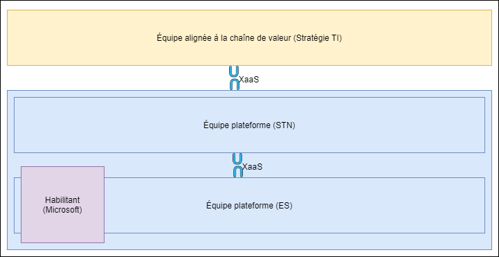
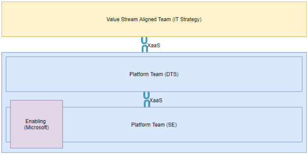
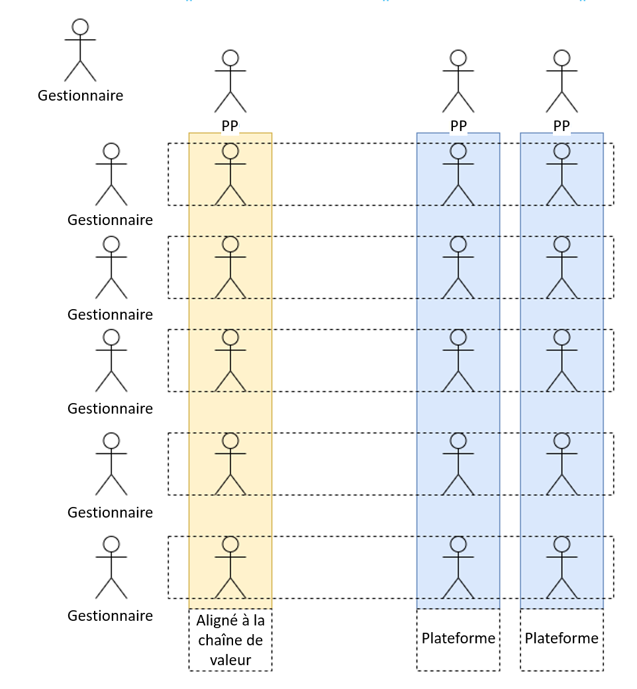
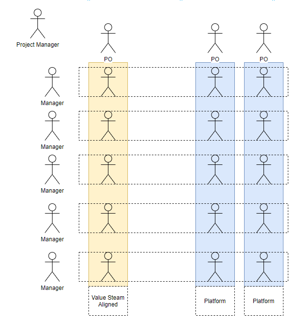
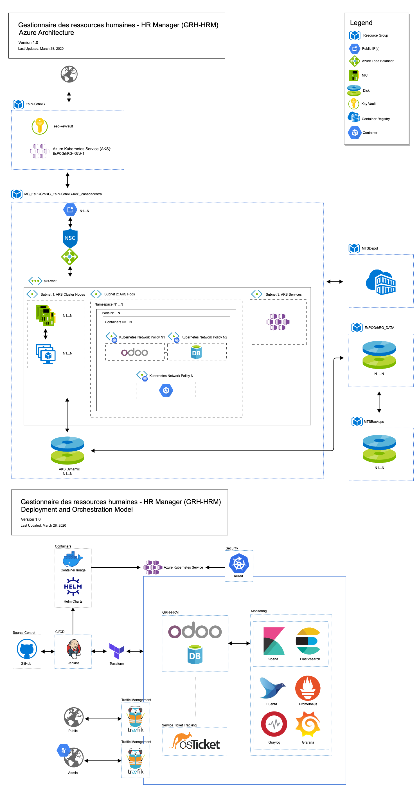

  

### Devops Journey: Over-engineering a Checkbox

#### Le périple

Présentation Stratosphere

  

  

### Devops Journey: Over-engineering a Checkbox

#### The Journey

Stratosphere Presentation

  

--

- Jayson McIntosh, TBS-(French Acronym)
  - [@jaysonmcintosh](https://twitter.com/jaysonmcintosh)
- Omar Nasr, ESDC-ESDC
  - [@thenextmusk](https://twitter.com/thenextmusk)

---

## Who | Qui

--

  

    Nous étions composés de deux équipes principales réparties dans deux DG de la même direction (DGIIT) ainsi que de collaborateurs de tout le gouvernement.
  

  

    We were composed of two main teams across two DG's in the same branch ( IITB ) as well as collaborators from across government.
  

---

  

## Quoi

Démo au DPI en 10 jours avec LL

Première application dans le nuage PB

- Dans le nuage PB dans les minutes suivant sa disponibilité
- Les utilisateurs testent en production en l'espace de 2 heures

  

  

## What

Demo to CIO in 10 days using OSS

First app on PB Cloud

- On PB Cloud within minutes of being available
- Users testing on production within 2 hours

  

---

  

## Comment

- Modèle de topologies d'équipe (équipes DevOps)

  - Augmenter la cadence
  - Renforcer les compétences des équipes

  

  

## How

- Team Topologies Model (DevOps Teams)

  - Increase flow
  - Upskill teams

  

--

  

## Comment

  

  

## How

  

--

  

## Comment

- Pour plus de détails, consultez [Team Topologies Inspired Whitelist App Development (anglais)](https://sara-sabr.github.io/ITStrategy/2020/05/20/Team-Topologies-Whitelisting-app.html)

  

  

## How

- For more details, read [Team Topologies Inspired Whitelist App Development](https://sara-sabr.github.io/ITStrategy/2020/05/20/Team-Topologies-Whitelisting-app.html)

  

--

  

### Topologies d'équipe : Gouvernementisé

  

  

### Team Topologies: Governmentized

  

--

  

### Pourquoi?

Renforcer les compétences des équipes et réduire leur taille

  

  

### Why?

Upskill teams & miminize size

  

---

  

## How (for real)

  

  

## How (for real)

  

--

  

### Architecture de haut niveau

  

  

### High-Level Architecture

  

--

  

#### Architecture de l'infonuagique

  

  

#### Cloud Architecture

  

--

  

### La sécurité en ce moment

- perspective réglementaire / gestion des risques
- liste de contrôle d'environ 300 éléments dont la plupart n'étaient pas pertinents
- approche du château et des douves

  

  

### Security Now

- regulatory/risk management perspective
- checklist of approximately 300 items of which most were irrelevant
- castle and moat approach

  

--

  

### La sécurité devrait être quoi?

- [modèle de confiance zéro](https://www.cloudflare.com/learning/security/glossary/what-is-zero-trust/)
- contrôles de sécurité automatisés
- Concentrez-vous sur la sécurité des applications et du réseau

pare-feu !== La sécurité

  

  

### What Security Should Be

- [zero trust model](https://www.cloudflare.com/learning/security/glossary/what-is-zero-trust/)
- automated security checks
- focus on application and network security

firewall !== security

  

---

  

## Comment y arriver?

  

  

## How to get there?

  

--

  

 Embauchez de bonnes personnes non pas pour leur dire quoi faire, mais pour qu'elles vous disent quoi faire

  

  

 Hire good people not to tell them what to do, but for them to tell you what to do

  

--

  

  
### Les autre choses

- Accés aux outils modern
- L'automatisation
- Compétences nécessaires
- Interopérabilité

  

  

  
### The Other Stuff

- Access to modern tooling
- Ability to automate
- Necessary skills and interoperability

  

---

  

  
## Éléments retenus

### Les bons, les mauvais, et les vilains

  

  

  
## Takeaways

### The Good, The Bad... The Ugly

  

--

  

  
### Les bons

- Équipes multidisciplinaires
- Accés aux outils non conforme
- C'est possible

  

  

  
### The Good

- Multidisciplinary teams
- Access to rogue tooling
- It’s possible

  

--

  

  
### les mauvais

- C'était un bandaid
    - Interop 
    - Outils interne
    - Syndrome du Excel
    - Intégrité des données
- Trop de travail, trop peu de temps

  

  

  
### The Bad

- This was a bandaid
    - Interop 
    - Internal tooling
    - Spreadsheet syndrome 
    - Data integrity
- Too much work, too little time

  

--

  

  
### les vilains

- Problèmes de maintenance
- Problèmes de propriété

  

  

  
### The Ugly

- Maintenance issues
- Ownership issues

  

--

  

  
C'est tout. Des questions?

  

  

  
It's over. Questions?

  

